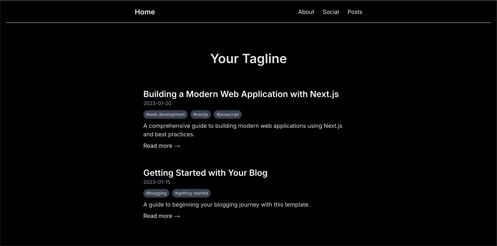

# nextjs-minimal-blog

[](https://github.com/KaramelBytes/nextjs-minimal-blog)
[](https://github.com/KaramelBytes/nextjs-minimal-blog)
[](https://github.com/KaramelBytes/nextjs-minimal-blog)

## 🌐 [Live Demo](https://nextjs-minimal-blog.vercel.app)

A vibe-coded, minimalist, and responsive blog built with Next.js 13+, Tailwind CSS, and Markdown. This project is a personal playground for experimenting with blog tech, SEO, and social integrations—crafted entirely by vibes and intuition, powered by AI.



---

## What is Vibe-Coding?
This project follows the vibe-coding philosophy—where code isn’t just functional, it’s a reflection of personal style and intuition. Every feature, layout, and integration was chosen because it felt right. The result: a blog that’s as much about the journey as the destination.

### Development Approach
This blog was built with a vibe-coding workflow powered by AI:
- **Primary Development:** SWE-1
- **Quality Assurance & Troubleshooting:** Gemini 2.5 Pro
- **Development Environment:** Windsurf IDE for seamless AI collaboration

---

## Tech Stack
- **Framework:** Next.js 13+ (App Router)
- **Styling:** Tailwind CSS (for those crisp, vibey visuals)
- **Content:** Markdown posts (just drop `.md` files in `/posts`)
- **SEO & Metadata:** Automatic, with sitemap and metadata
- **Social Integration:** Bluesky & Pixelfed feeds (optional, via `.env.local`)
- **Syntax Highlighting:** For code blocks in posts
- **Responsive & Dark Mode:** Looks good everywhere, day or night
- **Security:** Custom security headers via middleware

---

## Purpose
This repository is a demo and reference for modern, minimalist blog setups. It’s not a template for mass adoption or open-source collaboration—just a public display of what happens when you let vibes (and AI) guide your coding.

> **Not accepting contributions or issues.** If you vibe with it, fork away and make it your own!

---

## Key Features
*   **Next.js 13+ (App Router)**
*   **Tailwind CSS** for styling
*   **Markdown-based posts** in `/posts`
*   **SEO, RSS, and Sitemap** out of the box
*   **Social feeds** from Bluesky and Pixelfed (optional)
*   **Security headers** via `middleware.js`
*   **Responsive and dark mode**
*   **Easy deployment** (Vercel, Netlify, etc.)

---

## Project Structure
```
nextjs-minimal-blog/
├── app/           # Next.js app directory (pages, layout, social, etc.)
├── posts/         # Your Markdown blog posts
├── public/        # Static assets (images, favicon, etc.)
├── lib/           # Helper libraries (fetch social posts, etc.)
├── config.js      # Site config
├── middleware.js  # Security headers
├── tailwind.config.mjs
├── package.json
└── ...
```

---

## Customization
1. **Site Metadata:** Edit `/app/layout.js` for title, description, etc.
2. **About Page:** Customize `/app/about/page.js`.
3. **Homepage:** Update `/app/page.js`.
4. **Styling:** Edit `/app/globals.css` and tweak `tailwind.config.mjs`.
5. **Posts:** Add Markdown files to `/posts/` with frontmatter:
   ```markdown
   ---
   title: "Post Title"
   date: "2025-01-01"
   author: "Your Name"
   tags: ["tag1", "tag2"]
   excerpt: "A brief description."
   ---
   # Your content here
   ```
6. **Social Feeds:**
   - Set up Bluesky and Pixelfed by adding credentials to `.env.local` (see below).
7. **Security:** Security headers are set in `middleware.js`.

---

## Prerequisites
* [Node.js 16.8+](https://nodejs.org/)
* npm or yarn

---

## Getting Started
1. **Clone the repository:**
   ```bash
   git clone https://github.com/KaramelBytes/nextjs-minimal-blog.git
   cd nextjs-minimal-blog
   ```
2. **Install dependencies:**
   ```bash
   npm install
   # or
   yarn
   ```
3. **Start the dev server:**
   ```bash
   npm run dev
   # or
   yarn dev
   ```
4. **View at:** [http://localhost:3000](http://localhost:3000)

---

## Environment Variables & Social Integration
Create a `.env.local` file in your project root:
```
# Required for production
NEXT_PUBLIC_SITE_URL=https://yourdomain.com

# Bluesky Integration (optional)
BLUESKY_HANDLE=yourhandle.bsky.social
BLUESKY_APP_PASSWORD=your-app-password-here

# Pixelfed Integration (optional)
PIXELFED_INSTANCE=https://your-pixelfed-instance.com
PIXELFED_USER_ID=your-user-id
PIXELFED_ACCESS_TOKEN=your-access-token

# Revalidation (optional)
REVALIDATION_SECRET=your-secret-key-here
```
**Important:** Add `.env.local` to `.gitignore`.

---

## Deployment
This site can be deployed anywhere that supports Next.js:
- **Vercel:** Import the repo, follow prompts
- **Netlify, AWS Amplify, Railway, etc.:** Set build command to `npm run build` and output to `.next`

---

## License
MIT License. See [LICENSE](LICENSE).

---